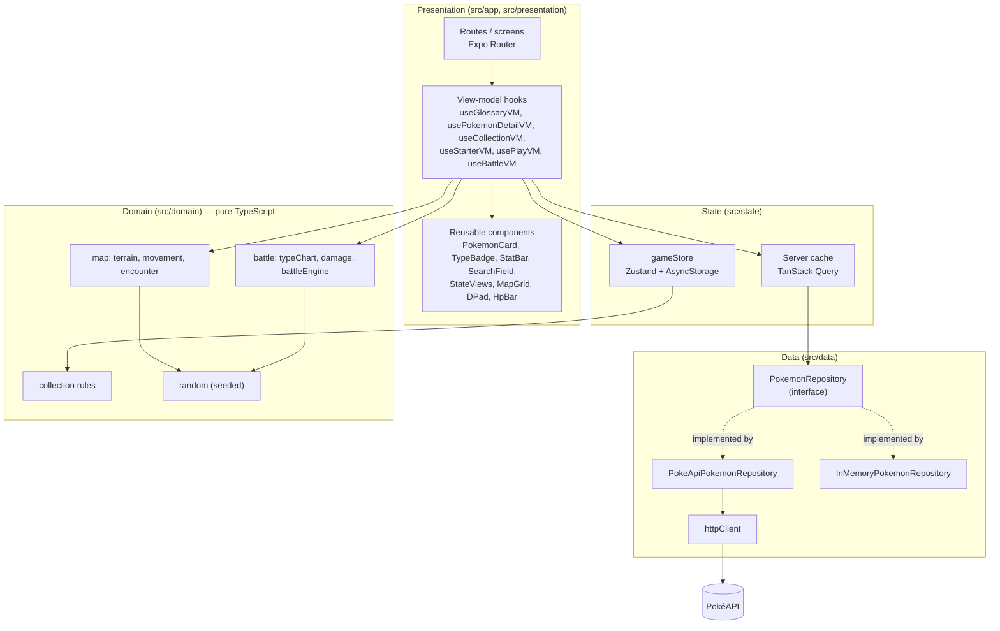
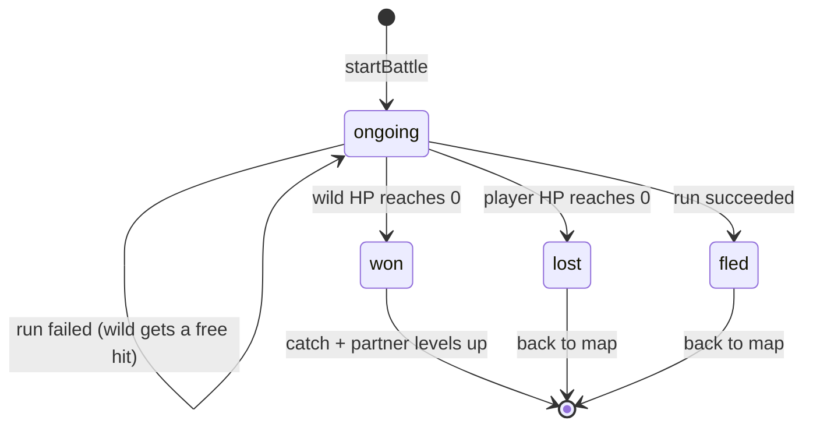
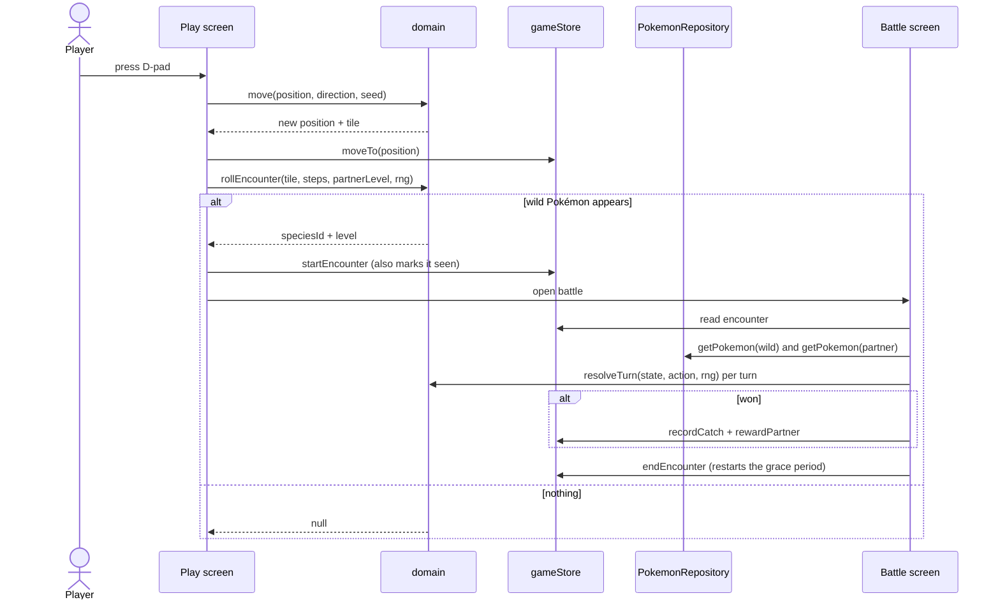

# Architecture

This document describes how Pokédex Quest is structured and why. Individual decisions are recorded as ADRs in [`docs/adr`](./adr).

## Goals

The brief asks for a mobile Pokédex backed by a public API. The app extends that with a small game: walk an infinite map, meet wild Pokémon, battle, and catch them. The architecture has to serve four goals.

1. The Pokédex must stay the priority. The game is an addition and must not weaken it.
2. The game rules must be testable without a phone, a network, or React.
3. The tester should be able to try it in a browser in seconds, and on Android without an app store.
4. The code should read like production work: clear layers, reusable pieces, and automated checks.

## Layers

The code is split into four layers. Dependencies only point downward: the domain knows nothing about React, storage, or HTTP.



| Layer | Folder | Responsibility | Knows about |
|---|---|---|---|
| Presentation | `src/app`, `src/presentation` | Screens, navigation, view-model hooks, reusable components | State, Data, Domain |
| State | `src/state` | Persisted game state (collection, world position) and the server-data cache | Domain |
| Data | `src/data` | Fetching PokéAPI and mapping raw responses to domain models | Domain models only |
| Domain | `src/domain` | Every game rule, as pure functions | Nothing |

### Presentation pattern

Screens follow MVVM, the pattern React naturally supports. A route file (the View) renders and forwards user events. A view-model hook owns screen state, calls the repository through TanStack Query, and calls domain functions. The Model is the domain layer. This keeps screens thin and makes view models testable with React Native Testing Library.

The repository reaches view models through a React context (`RepositoryProvider`), which is how tests inject the in-memory implementation. Query keys and fetchers are defined once in `presentation/queries/pokemonQueries.ts` and reused by every screen.

Every list shares the same loading, error and empty components (`StateViews`), so all screens fail and recover the same way: errors explain what went wrong and offer "Try again", and empty states point to the next action.

## Key design decisions

### The infinite map is a formula, not stored data

`tileAt(x, y, seed)` computes any tile from seeded value noise: elevation decides water, sand, land and forest, moisture decides tall grass, and a third noise band draws footpaths. Nothing is stored, so the world is infinite at zero memory cost, and the same seed always gives the same world. Only the seed and the player's position are saved. The renderer asks `getViewport()` for the visible window of tiles, so cost stays constant no matter how far the player walks. See [ADR 0003](./adr/0003-procedural-infinite-map.md).

### All randomness is injected

Every random decision takes an `Rng` argument instead of calling `Math.random()`. In the app, one generator is seeded when the session starts (`shared/sessionRng.ts`) and shared by all screens; in tests it can be a fixed value or sequence. This is what makes encounters and battles fully unit-testable, including edge cases such as a failed escape or a speed tie.

### Battle is a reducer

`resolveTurn(state, action, rng)` returns a new `BattleState` and never mutates the old one. The UI only dispatches actions and animates `state.lastTurn`, the ordered list of events from the latest turn. `buildTurnFrames` turns those events into frames, each a message plus the HP to show with it, and the view model plays them back one at a time. The result is saved as soon as the engine decides it, before the animation, so it cannot be lost. See [ADR 0006](./adr/0006-battle-flow.md).



Turn order goes to the faster Pokémon, with a coin flip on ties. Damage follows a simplified main-series formula with same-type attack bonus (STAB), the full 18-type chart, and a 85–100% random roll. Each Pokémon gets Tackle plus one signature move per type it has.

### The repository is the only data contract

The UI depends on the `PokemonRepository` interface. `src/data/index.ts` is the single place that picks an implementation: PokéAPI by default, or fixtures when `EXPO_PUBLIC_USE_MOCK_API=true`. The mock returns a playable placeholder for any id, so the whole game loop runs offline. See [ADR 0004](./adr/0004-repository-with-offline-mock.md).

## Data flow

### Glossary

The Glossary fetches the full species index once (about 1,300 names in one request of roughly 60 KB) and filters it on the device, so search is instant. List rows build their artwork URL from the id, which avoids one detail request per row. Details load only when a Pokémon is opened. Pokémon data never changes, so TanStack Query caches it for the session (`staleTime: Infinity`) and only retries transient errors.

### Game loop



A battle can only open from a real encounter held in the store, never from the URL. Encounters happen only in tall grass, at 12% per step, with a four-step break after each battle. Legendaries are 20 times rarer than ordinary Pokémon, and starter lines and big rares are 5 times rarer. Wild levels stay within two of the partner's level.

## Folder structure

```
src/
  app/                  Expo Router routes (screens only)
  presentation/
    battle/             battle narration frames
    components/         Reusable UI pieces
    hooks/              View-model hooks
    providers/          Query client and repository injection
    queries/            Query keys and fetchers
  state/                gameStore (Zustand, persisted)
  data/
    api/                httpClient, PokéAPI DTO types
    mappers/            DTO → domain
    repositories/       Interface, PokéAPI and in-memory implementations
    fixtures/           Trimmed real responses for tests and offline mode
  domain/
    map/                terrain, movement, encounter
    battle/             typeChart, combatant, damage, battleEngine
    collection/         catch, seen, partner, level rules
    pokedex/            search, filter and paging
    random.ts           Seeded Rng
    models.ts           Domain entities
  shared/               config, theme tokens, formatting, colour helpers
  test-utils/           Shared test factories
```

## Quality gates

| Check | Tool | Where it runs |
|---|---|---|
| Lint | ESLint with `eslint-config-expo` | Locally and in CI |
| Types | TypeScript strict, `noUncheckedIndexedAccess` | Locally and in CI |
| Unit and component tests | Jest (`jest-expo`) and React Native Testing Library | Locally and in CI |
| Coverage | Thresholds on `src/domain` and view models (90%) and `src/data` (85%) | CI fails if coverage drops |
| Build | `expo export --platform web` | CI, uploaded as an artifact |

## Delivery

| Target | How | For whom |
|---|---|---|
| Web | Vercel, built from `main` | The fastest way for a reviewer to try it |
| Android | EAS Build `preview` profile, an installable APK link | Reviewers on Android |
| iOS | Expo Go, or the web version | TestFlight needs a paid Apple account, so it is out of scope |
